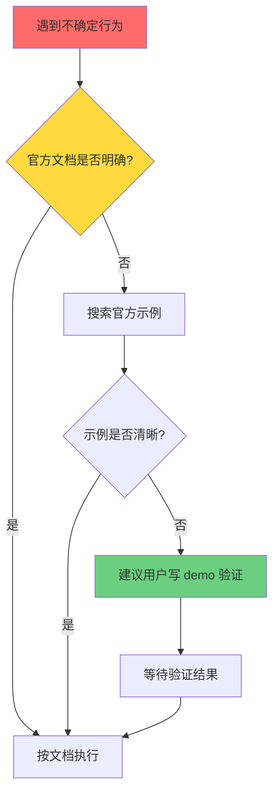

# 开发规范 (Development Specification)

**版本**: 1.0.0  
**生效日期**: 2025-02-09  
**适用范围**: 所有使用第三方库的开发工作

---

## 规范目标 (Objectives)

建立强制性的开发流程，确保所有代码编写基于**确定性知识**而非**假设或经验**，避免因错误假设导致的返工和问题积累。

---

## 核心原则 (Core Principles)

### P1: 文档优先原则 (Documentation First)

**规则**: 使用任何第三方库 API 前，必须先查阅官方文档。

**执行要求**:
- ✅ 必须明确：API 参数含义、返回值、副作用、状态变化
- ✅ 必须确认：坐标系定义、数据结构、事件触发时机
- ❌ 禁止：基于"通常是这样"、"其他框架这样做"的假设

**检查点**:
```yaml
before_coding:
  - question: "我是否已查阅官方文档？"
    required: true
  - question: "我是否明确了 API 的准确行为？"
    required: true
  - question: "我的理解是基于文档还是假设？"
    answer_must_be: "文档"
```

---

### P2: 不确定即停止原则 (Stop When Uncertain)

**规则**: 遇到任何不确定的 API 行为时，立即停止编码。

**执行流程**:


**禁止行为**:
- ❌ 在不确定的基础上继续编写代码
- ❌ "先试试看，不行再说"
- ❌ "应该差不多是这样"

---

### P3: 问题诊断层级原则 (Diagnostic Hierarchy)

**规则**: 出现问题时，按固定层级诊断，不跳级。

**诊断层级**:
```yaml
level_1:
  name: "重新阅读官方文档"
  action: "确认是否理解错误 API 行为"
  output: "文档原文 + 我的理解 + 差异分析"

level_2:
  name: "对比官方示例"
  action: "找出代码与官方示例的差异"
  output: "差异列表 + 可能原因"

level_3:
  name: "日志验证实际行为"
  action: "通过日志确认实际行为与文档是否一致"
  output: "预期行为 vs 实际行为对比"

level_4:
  name: "最小可复现 demo"
  action: "隔离问题，创建最小复现代码"
  output: "可独立运行的 demo 代码"
```

**禁止行为**:
- ❌ 直接调整参数试错
- ❌ 在错误假设上打补丁
- ❌ 跳过文档检查直接改代码

---

## 工作流程 (Workflow)

### 阶段 1: 需求分析
```yaml
input: 用户需求描述
steps:
  - identify_apis: 识别需要使用的第三方 API
  - list_uncertainties: 列出所有不确定的行为
output: 需要查阅的文档清单
```

### 阶段 2: 文档查阅（强制）
```yaml
input: 文档清单
steps:
  - read_official_docs: 阅读官方文档相关章节
  - confirm_behavior: 确认 API 的准确行为
  - document_findings: 记录文档要点
output: API 行为确认清单
action_if_unclear: 转到"阶段 3: 验证测试"
```

### 阶段 3: 验证测试（可选）
```yaml
trigger: 文档不明确或有歧义
steps:
  - suggest_demo: 建议用户创建最小测试 demo
  - wait_result: 等待测试结果
  - update_findings: 更新 API 行为理解
output: 验证后的 API 行为
```

### 阶段 4: 代码实现
```yaml
input: 确认的 API 行为
prerequisite: 必须完成阶段 2 或阶段 3
steps:
  - implement: 基于确定的行为编写代码
  - add_comments: 添加注释说明依据的文档章节
output: 实现代码 + 文档引用
```

### 阶段 5: 问题诊断
```yaml
trigger: 代码运行结果与预期不符
steps:
  - apply_diagnostic_hierarchy: 按 P3 原则执行诊断层级
  - identify_root_cause: 识别根本原因（理解错误 vs 实现错误）
  - fix_or_clarify: 修复代码或重新理解文档
forbidden:
  - random_parameter_tuning: 随机调整参数
  - assumption_based_fix: 基于新假设打补丁
```

---

## 禁止清单 (Forbidden Practices)

### 语言层面
```yaml
forbidden_phrases:
  - "我觉得应该是..."
  - "通常框架都这样..."
  - "可能是..."
  - "试试这样..."
  - "差不多应该..."
  
required_phrases:
  - "根据官方文档 X.X 章节..."
  - "文档明确说明..."
  - "官方示例展示..."
  - "实测验证结果是..."
```

### 行为层面
```yaml
forbidden_actions:
  - code_before_docs: 
      description: "不查文档直接编码"
      severity: critical
      
  - assumption_based_coding:
      description: "基于经验假设编写代码"
      severity: critical
      example: "假设 X6 子节点使用相对坐标"
      
  - patch_on_wrong_assumption:
      description: "在错误假设上打补丁"
      severity: high
      example: "添加各种坐标转换、刷新机制"
      
  - skip_diagnostic_hierarchy:
      description: "跳过文档检查直接调参"
      severity: high
```

---

## 案例库 (Case Studies)

### 案例 1: X6 父子节点坐标系问题

**背景**: 实现设备节点入组到系统容器的功能

**错误做法**:
```yaml
assumption: "子节点应该使用相对于父节点的坐标"
based_on: "通用 UI 框架的经验"
actions:
  - 编写坐标转换函数 toLocalCoordinate/toGlobalCoordinate
  - 在 addChild 后手动设置相对坐标
  - 添加视图刷新、prop 触发等补丁
result: "设备节点位置错误，反复调试无效"
time_wasted: "多轮迭代，大量调试"
```

**正确做法**:
```yaml
step_1: "查阅 X6 官方文档关于 addChild 的说明"
step_2: "确认子节点的坐标系定义"
finding: "X6 的 addChild 不改变子节点坐标值，仍使用绝对坐标"
action: "直接 addChild，不做任何坐标转换"
result: "一次性解决，无需补丁"
```

**教训**:
- 不能基于其他框架的经验假设 X6 的行为
- 日志显示 `addChild 后坐标未变` 就应该立即重新检查文档
- 确定性知识（文档）>> 经验假设

---

## 检查清单 (Checklist)

### 编码前检查
```markdown
- [ ] 我已查阅了相关 API 的官方文档
- [ ] 我明确了 API 的参数、返回值、副作用
- [ ] 我的理解基于文档而非假设
- [ ] 对于不确定的行为，我已标记待验证
```

### 问题诊断检查
```markdown
- [ ] 我已重新阅读官方文档
- [ ] 我已对比官方示例代码
- [ ] 我通过日志验证了实际行为
- [ ] 我确认问题不是由错误假设导致
```

### 代码审查检查
```markdown
- [ ] 代码中没有基于假设的实现
- [ ] 关键 API 调用有文档引用注释
- [ ] 没有"试试看"性质的补丁代码
- [ ] 坐标系、状态机等核心概念有明确定义
```

---

## 强制执行 (Enforcement)

### 触发条件
当满足以下任一条件时，必须执行本规范：
- 使用第三方库的任何 API
- 遇到行为不确定的情况
- 代码运行结果与预期不符
- 需要理解坐标系、状态机等核心概念

### 违规后果
```yaml
violation_detected:
  action: "立即停止当前方案"
  required: "回到阶段 2: 文档查阅"
  forbidden: "在违规代码上继续调整"
  
examples:
  - scenario: "发现代码基于假设编写"
    action: "删除假设相关代码，重新查阅文档"
    
  - scenario: "多次调试无效"
    action: "停止调试，重新理解文档"
```

---

## 版本历史 (Version History)

### v1.0.0 (2025-02-09)
- 初始版本
- 基于 X6 父子节点坐标系问题的经验教训
- 建立文档优先、禁止假设的核心原则

---

## 附录: 参考资源 (References)

### 官方文档链接
```yaml
antv_x6:
  url: "https://x6.antv.antgroup.com/"
  key_sections:
    - "API Reference > Graph > addChild"
    - "Tutorial > Node > Parent-Child Relationship"
    
element_plus:
  url: "https://element-plus.org/"
  
vue:
  url: "https://vuejs.org/"
```

### 检查工具
```yaml
before_api_usage:
  tool: "文档查阅检查清单"
  mandatory: true
  
problem_diagnosis:
  tool: "诊断层级流程图"
  mandatory: true
```

---

**规范维护**: 本规范将根据实际问题不断更新案例库和检查清单。

**强制性**: 本规范为强制执行，所有 AI 辅助开发必须遵守。
